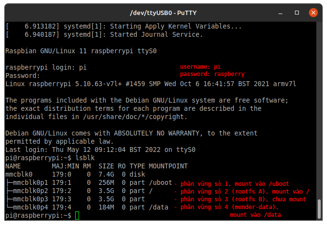
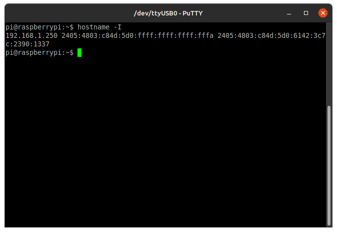

# Terms:

- **target**: Board máy tính nhúng cần cài mender lên.
- **host**: Máy tính, laptop dùng để cài mender cho target, chạy bất kỳ hệ điều
  hành nào, miễn chạy được các tool ở dưới.
- **mender-server**: Phần mềm do Mender cung cấp, chạy trên host hoặc cloud
  server hoặc bất kỳ máy nào chạy hệ điều hành mà client có thể kết nối tới.
  [Mender-server do mender cung cấp sẵn](hosted.mender.io) được gọi là
  `hosted-mender`
- **mender-client**: Phần mềm do Mender cung cấp, chạy trên target, chờ lệnh
  update từ mender-server.
- **mount**: trạng thái mà 1 phân vùng được gắn với 1 thư mục (mount point) trên
  `/` để Linux có thể truy cập được phân vùng đó. Phân vùng của một ổ vật lý
  được list trong /dev dưới dạng:
  - /dev/mmcblkXpY - Đối với thẻ nhớ, X là số thứ tự ổ vật lý, Y là số phân vùng
    trên ổ đó.
  - /dev/nvme0nXpY - Đối với SSD, X là số thứ tự ổ vật lý, Y là số phân vùng
    trên ổ đó.
  - /dev/sdXY - Đối với ổ HDD, X là thứ tư alphabet ổ vật lý, Y là số phân vùng
    trên ổ đó..

# Cách cài mender client cho system-update

File .img cài sẵn do mender cung cấp, có cài sẵn `mender-client`, các phân vùng
(`rootfs A/B`, `boot`, `mender-data`) và các config để `mender-client` chạy.

`Board phát triên` và các `board cần update` phải cài chung từ một file .img

Các bước cài mender bằng file .img:

1. Tải file .img do mender cung cấp.
2. Giải nén file vừa tải
3. Flash file vào thẻ nhớ
4. Chạy trên board

## Tải file .img

Mender có cung cấp file .img hỗ trợ chính thức cho RPi 3 và 4.

Tải file .img cho các board máy tính nhúng khác: [Mender Hub community
forum](https://hub.mender.io/c/board-integrations/debian-family/11)

File tải về có định dạng .img.xz 563MB.

## Giải nén

Sử dụng `7zip`, `xz` hoặc `WinRAR` để giải nén file thành file .img. File giải
nén ra 8GB nên cần ổ cứng trống hơn 8GB để chứa file.

## Flash vào thẻ nhớ

Sử dụng dd hoặc `Win32 Disk Imager` để flash vào thẻ nhớ. Thẻ nhớ cần phải lớn
hơn 8GB hoặc bằng, trường hợp nhỏ hơn 1-2GB vẫn chấp nhận được.

Nếu flash thành công, nếu host là Linux thì ta có thể thấy các phân vùng khi chạy `lsblk`


## Chạy trên board

Hệ điều hành đã được Mender config sẵn serial-console trên `UART0` chỉ cần cắm
uart-to-usb vào là có thể thấy được `kernel-bootlog` và shell để chạy lệnh sau
khi boot thành công. 

Sử dụng putty, kitty, minicom, screen hoặc bất kỳ phần mềm serial-console chạy
trên host. Bật nguồn Rpi chờ 5s để bootloader load. Trên serial-console hiện
kernel-bootlog gửi từ Rpi  

Sau khi đăng nhập với username `pi`, password `raspberry` mặc định, chạy `lsblk`
để list ra danh sách phân vùng của thẻ nhớ. 

Ta có thể thấy trong ảnh trên, `root` (hay `/`) đang được mount từ phân vùng số
2 của thẻ nhớ.

# Cách sử dụng mender system-update

System-update là update cả phân vùng rootfs. Có nghĩa là ta phải cần một `phân
vùng rootfs mẫu`. Mẫu này sẽ được update cho tất cả các board đang chạy cùng hệ
điều hành có cài mender-client. Ví dụ: 
> Ta có 10 board đang chạy ứng dụng
> (app-boards) và 1 board phát triển (dev-board). Khi ứng dụng trên `dev-board`
> đạt mức ổn định và có thể release cho 10 `app-boards`, với mục tiêu để  môi
> trường trên `app-board` giống với `dev-board` nhất có thể thì ta clone phân vùng
> rootfs đang chạy ổn định trên `dev-board` lên tất cả `app-boards`. 

Việc clone có thể thực hiện bằng tay với `dd`. Clone phân vùng rootfs của `dev-board`
thành file .img, ghi file đó đè vào phân vùng rootfs đang chạy của `app-boards`.
Hoặc sử dụng Mender để tự động hóa quá trình ghi đè này (deploy).

`File image rootfs clone từ dev-board` được chuyển thành một file gọi là `artifact` bằng công cụ `mender-artifact`. Hoặc có thể sử dụng `mender-artifact` kết hợp `ssh` (snapshot) để chuyển thẳng rootfs trên `dev-board` đang chạy thành file artifact. Như vậy có 2 cách để tạo `artifact`:

Các bước để  tạo `system-update`:

1. Clone phân vùng rootfs của `dev-board` thành file .img.
2. Cài `mender-artifact` trên host (nếu chưa). Chuyển file .img vừa clone thành file `artifact`.
3. Tải file `artifact` lên `mender-server`.
4. Tạo deployment trên `mender-server`.
5. Kết thúc.

Nếu dùng snapshot của `mender-artifact`:

1. Cài `mender-artifact` trên host (nếu chưa). Dùng `mender-artifact` snapshot chuyển phân vùng rootfs của board đang chạy thành file `artifact`.
2. Tải file artifact lên `mender-server`.
3. Tạo deployment trên `mender-server`.
4. Kết thúc.

## Cài `mender-artifact`

Mender-artifact là phần mềm chuyển `file .img của một phân vùng rootfs` thành `artifact`.

Mender chỉ hỗ trợ mender-artifact trên Linux và Mac OS X. Để sử dụng được trên Windows, có thể sử dụng máy ảo hoặc [WSL](https://docs.microsoft.com/en-us/windows/wsl/install).

### Đối với Linux

Tải file mender-artifact 3.7.1 tại [mục download của Mender docs](https://docs.mender.io/downloads#mender-artifact).

Di chuyển terminal tới thư mục chứa file vừa tải xuống, chạy:

```bash
chmod +x ./mender-artifact
```

 để cấp quyền thực thi cho file `mender-artifact`.

Nếu thành công, chạy:

``` bash
./mender-artifact -v
```

sẽ có kết quả:


## Clone một phân vùng rootfs của `dev-board` thành .img

Yêu cầu:

- Máy host sử dụng được dd, Win32 Disk Imager hoặc các phần mềm tương tự.
- Máy host truy cập được phân vùng của thẻ nhớ từ cắm vào từ `dev-board`.

Xác định phân vùng cần clone.
Phân vùng cần clone là phân vùng rootfs A hoặc B đang mount vào `/` khi boot trên board. [Ví dụ.](#chạy-trên-board)

Cắm thẻ nhớ vào host. List danh sách các phân vùng bằng `lsblk`.


Giả sử để clone phân vùng số 2, chạy `dd`:

``` sh
sudo dd if=/dev/mmcblk0p2 of=p2rootfs.ext4 bs=8M conv=fdatasync status=progress
```

Tham số:

>`sudo` - Sủ dụng sudo để lấy quyền truy cập /dev/mmcblk0p3.
>
>`if=/dev/mmcblk0p2` - input file là phân vùng số 2 của thẻ nhớ số 0
>
>`of=p2rootfs.img` - output file, file này được tạo ra tại thư mục mà terminal đang đứng [(pwd)](https://en.wikipedia.org/wiki/Pwd) và có tên là `p2rootfs.img`.
>
>`bs=8M conv=fdatasync status=progress` - Kích cỡ mỗi lần copy, flush disk cache, hiện thị trạng thái.

Chờ 30 phút, tùy theo dung lượng thẻ nhớ. Sau khi chạy xong, một file tên `p2rootfs.img` sẽ được tạo ra, có kích thước bằng dung lượng phân vùng vừa clone.

## Chuyển file .img vừa clone thành file artifact

Mender-server chỉ nhận file artifact có phần extension là .mender. 

Để tạo artifact, sử dụng mender-artifact. Di chyển terminal tới thư mục chứa file `mender-artifact` và file `p2rootfs.img`. Chạy:

```bash
./mender-artifact write rootfs-image \
-t raspberrypi4 \
-n release-test \
--software-version rootfs-vtest \
-f p2rootfs.img \
-o artifact.mender
```

Tham số:

> `write rootfs-image` - Ghi ra file artifact chứa rootfs
>
> `-t raspberrypi4` - Loại board mà Mender hỗ trợ.
>
> `-n release-test` - Tên release
>
> `--software-version rootfs-vtest` - Tên version
>
> `-f p2rootfs.img` - Tên file .img **input**
>
> `-o artifact.mender` - Tên file .mender **output**

Nếu thành công sẽ có 1 file tên `artifact.mender` được tạo ra trong thư mục mà terminal đang đứng.

## Mender-artifact snapshot

Một cách khác dễ hơn, ít tốn dung lượng ổ đĩa hơn để tạo artifact.

Yêu cầu:

- `Host` và `dev-board` phải chung một mạng LAN.
- `dev-board` phải bật `ssh server`, host có thể kết nối vào được.

Các bước sử dụng mender-artifact snapshot:

1. Cắm thẻ nhớ vào board, chạy, đăng nhập vào shell, kết nối wifi (mạng), xem địa chỉ ip 

2. Bật ssh (nếu chưa)
3. Chạy mender-artifact trên host 

```bash
mender-artifact write rootfs-image \
    -f ssh://pi@192.168.1.250 \
    -t raspberrypi4 \
    -n system-test \
    -o system-test.mender
```

Tham số:

> `write rootfs-image` - Ghi ra file artifact chứa rootfs
>
> `-f ssh://pi@192.168.1.250` - Sử dụng ssh đến board **input**
>
> `-t raspberrypi4` - Loại board mà Mender hỗ trợ.
>
> `-n system-test` - Tên release
>
> `-o system-test.mender` - Tên file .mender **output**

## Tải file artifact lên mender-server

## Tạo deployment trên mender-server


